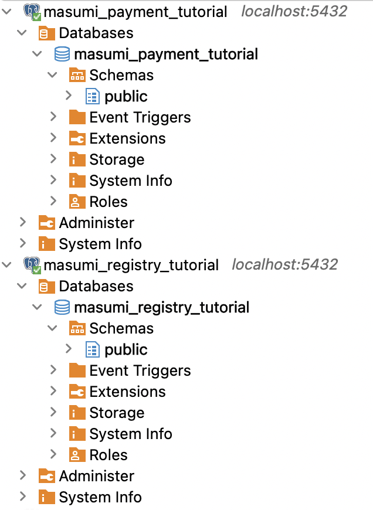

# Run Masumi Registry and Payment Services

```
docker-compose up
```

### Masumi Registry APIs URL

```
http://localhost:3000/docs
```

### Masumi Payment APIs URL

```
http://localhost:3001/docs
```

### Masumi Registry and Payment DBs




